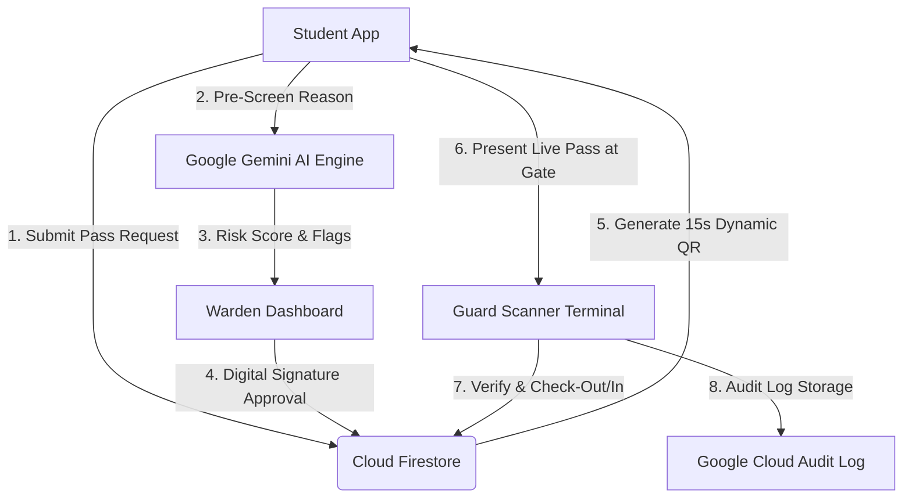

# 🛡️ HostelGatePass — Digital Gate Pass Management System

A tamper-proof, real-time **Digital Hostel Gate Pass System** built on **Google Cloud Platform**, **Firebase**, and **Google Gemini AI** to solve gate bypass problems in college hostels.

---

## 01. Problem
In college hostels, students frequently bypass gate security by showing old paper pass slips, sharing static screenshots of approved passes with friends via messaging apps, or sneaking out during peak hours. Hostel wardens and security guards lack real-time verification tools to check if a student leaving the campus actually holds a valid, unexpired pass authorized by the warden.

---

## 02. Why I Built This
I observed a critical vulnerability in my own college hostel: students were surpassing the main gate without showing legitimate warden-approved passes. Because guards had to manually inspect paper receipts or static images on student phones, forged passes were easily reused. I built this system to create an unforgeable, real-time digital workflow that connects students, wardens, and security guards seamlessly.

---

## 03. Solution
**HostelGatePass** is a web application built using Google Cloud technologies that replaces paper and static passes with **Dynamic Anti-Screenshot QR Codes** (which rotate security tokens every 15 seconds), automated **Gemini AI Risk Scoring** for warden approvals, and an instant **Guard Gate Scanner** with visual green/red flash cards and real-time Firestore database synchronization.

---

## 04. Key Decisions
- **15-Second Dynamic QR Code Token**: Instead of rendering static QR codes, the system generates rotating time-based cryptographic hashes with animated scan lines and bouncing watermarks to make screenshot sharing impossible.
- **Google Gemini AI Pre-Screening**: Integrated Gemini 2.5 Flash to automatically analyze student outing reasons and flag late-night or high-risk requests before wardens review them.
- **Audio-Visual Guard Terminal**: Designed the security guard interface with large green/red visual cards and synthesized audio tones to enable instant, 2-second decision-making at busy gate posts.
- **Reactive Firestore Data Sync**: Used Firestore real-time listeners so that the moment a warden approves a pass on their phone, the guard's scanner terminal updates immediately without page refreshes.

---

## 05. Features
- 🎓 **Student Portal**: Apply for Day Outing, Night Out, or Emergency passes. View active approved pass with dynamic rotating QR code and real-time return countdown.
- 👨‍⚖️ **Warden Dashboard**: Review pending pass requests with Gemini AI safety risk flags (`HIGH RISK` / `LOW RISK`), approve with digital signature stamps (`SIG-VKG-9981`), and monitor overdue curfew alerts.
- 👮 **Guard Scanner Terminal**: Camera QR code scanner, student photo verification, 1-tap Check-Out / Check-In timestamp logging, and gate activity stream.
- 📊 **Admin & Security Analytics**: View campus traffic stats, Google Cloud Platform integration status, and export gate audit logs to CSV.

---

## 06. Technology

| Google Technology | Purpose & Why Chosen |
|---|---|
| **Cloud Firestore** | Chosen for sub-second real-time synchronization between Warden approval actions and Security Guard gate scanners. |
| **Firebase Authentication** | Chosen to enforce single sign-on restricted to official college email domain (`@college.edu`). |
| **Google GenAI (Gemini AI)** | Chosen for intelligent reasoning analysis to automatically evaluate pass safety and curfew risk. |
| **Google Cloud Storage** | Chosen to securely host student profile photos and warden digital signatures. |
| **Google Maps Platform** | Chosen for location geofencing to ensure gate checkout happens physically at hostel gates. |

---

## 07. Architecture



---

## 08. Getting Started

### Local Prerequisites
- Node.js (v18+)
- npm (v9+)

### Installation & Run Steps
1. **Clone the repository**:
   ```bash
   git clone https://github.com/YOUR_USERNAME/digital-gate-pass.git
   cd digital-gate-pass
   ```

2. **Install dependencies**:
   ```bash
   npm install
   ```

3. **Launch local development server**:
   ```bash
   npm run dev
   ```

4. **Access the application**:
   Open [http://localhost:5173/](http://localhost:5173/) in your web browser. Switch roles using the top navbar (`🎓 Student`, `👨‍⚖️ Warden`, `👮 Guard Scanner`, `📊 Analytics`).

---

## 09. Deployment
- **Deployment Platform**: Configured for global deployment on **Google Cloud Platform** via **Firebase Hosting** and **Google Cloud Run**.
- **Environment Configuration**: Key settings are supplied via `.env` (`VITE_FIREBASE_API_KEY`, `VITE_GEMINI_API_KEY`). A built-in reactive emulated store is included so the app runs out-of-the-box for demonstration.

---

## 10. Limitations & Next Steps
- **Limitations**:
  - Requires mobile device camera access at security guard posts.
  - Currently relies on browser-based geofencing rather than physical hardware barrier integration.
- **Next Steps**:
  - Automated WhatsApp / SMS push notifications sent to student guardians upon gate checkout using Firebase Cloud Messaging (FCM).
  - Integration with automated RFID / NFC physical gate turnstiles.
  - Facial recognition photo match using Gemini Vision API at guard scanner terminals.
